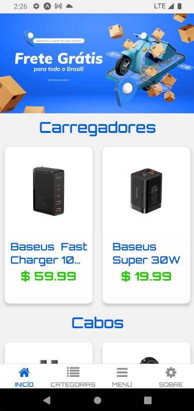
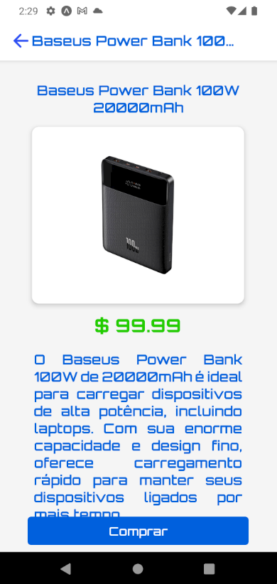
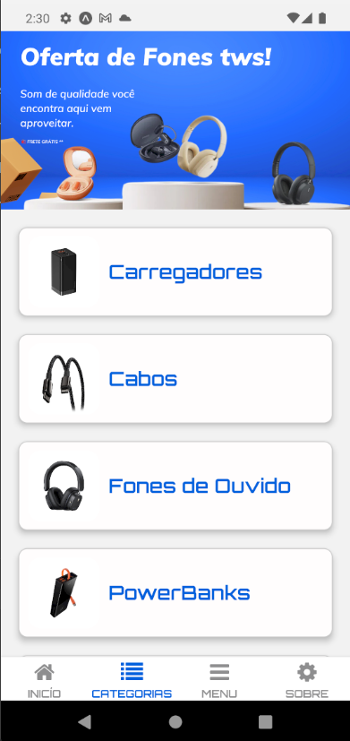
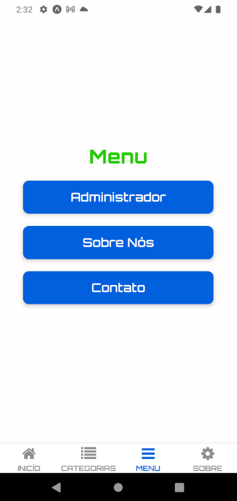
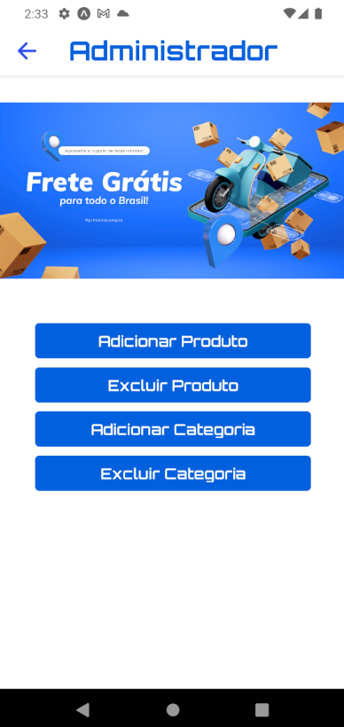
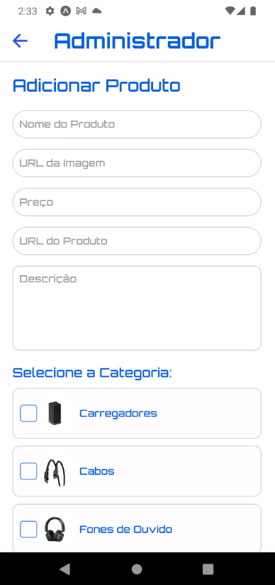
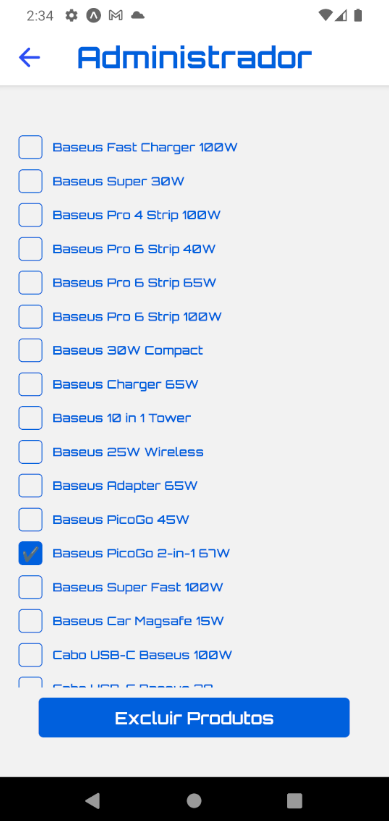
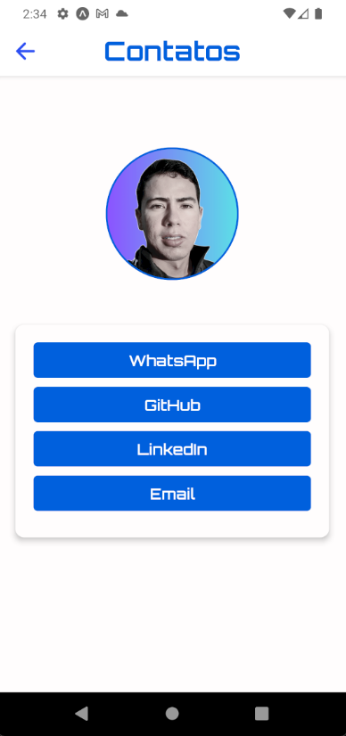

# Projeto App E-commerce

Este projeto é uma aplicação de e-commerce construída com React Native (para o front-end) e uma API hospedada no Vercel (para o back-end com node.js). A aplicação permite que usuários visualizem produtos, naveguem por categorias. além da página de administração onde realizam outras operações comuns em lojas virtuais, como adicionar e excluir produtos e categorias.


## Funcionalidades


- Listagem de produtos e categorias
- Detalhes de produtos individuais
- Adicionar e excluir produtos e categorias
- Conexão com a API remota no Vercel para operações de CRUD


## Tecnologias Utilizadas

Front-end
- React Native
- TypeScript
- Expo (para desenvolvimento e execução do app)
Back-end
- Node.js
- Express
- Axios (para chamadas à API)
Banco de Dados
- SQL Server hospedado no Azure
- Hospedagem
- Vercel (para a API)
## Instalação

## Pré-requisitos

- Node.js
- npm ou yarn
- Git
- Expo CLI (caso não tenha, instale com npm install -g expo-cli)

## passos

1. Clone o repositório:

```bash
  git clone https://github.com/AlexAbreuGomes/projeto-x.git
```
2. Instale as dependências do front-end:

```bash
  cd projeto-x
  npm install
```
3. Configure as variáveis de ambiente para o banco de dados e API se necessário
    
## Instalação Back-End
## passos

1. Clone o repositório:

```bash
  git clone https://github.com/AlexAbreuGomes/api-server-local.git
```
2. Instale as dependências do back-end:

```bash
  cd api-server-local
  npm install
```
## Uso
## Executando o front-end
Na raiz do projeto:

```
    npx expo start
```


## Uso
## Executando o back-end
Na raiz do projeto:

```
    vercel --prod
```
## Endpoints da API

- GET /products - Lista todos os produtos
- POST /addProduto - Adiciona um novo produto
- DELETE /deleteProduto/:id - Exclui um produto pelo ID
- GET /categories - Lista todas as categorias
- POST /addCategoria - Adiciona uma nova categoria

Nota: Certifique-se de substituir as URLs no código da aplicação pelo endereço da API em produção.
## Screenshots

## Screenshots

| Tela Inicial                          | Tela de Descrição do Produto           |
| ------------------------------------- | -------------------------------------- |
|  |  |

| Tela de Categorias                    | Tela de Menu                           |
| ------------------------------------- | -------------------------------------- |
|  |  |

| Login do Administrador                | Opções do Administrador                |
| ------------------------------------- | -------------------------------------- |
|  |  |

| Adicionar Produto                     | Excluir Produtos                       |
| ------------------------------------- | -------------------------------------- |
|  |  |

| Adicionar Categorias                  | Contatos                               |
| ------------------------------------- | -------------------------------------- |
|  |  |


## Contribuindo

Contribuições são sempre bem-vindas!

Por favor, siga o `código de conduta` desse projeto.

    1. Crie um fork do projeto.
    2. Crie uma nova branch: git checkout -b feature/nova-funcionalidade.
    3. Commit suas mudanças: git commit -m 'Adiciona nova funcionalidade'.
    4. Envie para a branch original: git push origin feature/nova-funcionalidade.
    5. Crie um Pull Request.


## Licença

## Licença

Este projeto é licenciado sob a Licença MIT. Isso permite que você use, copie, modifique, mescle, publique, distribua, sublicencie e/ou venda cópias deste software, desde que seja feita a devida atribuição ao autor original.

Para mais detalhes, consulte o arquivo `LICENSE`.

---

Licença MIT


